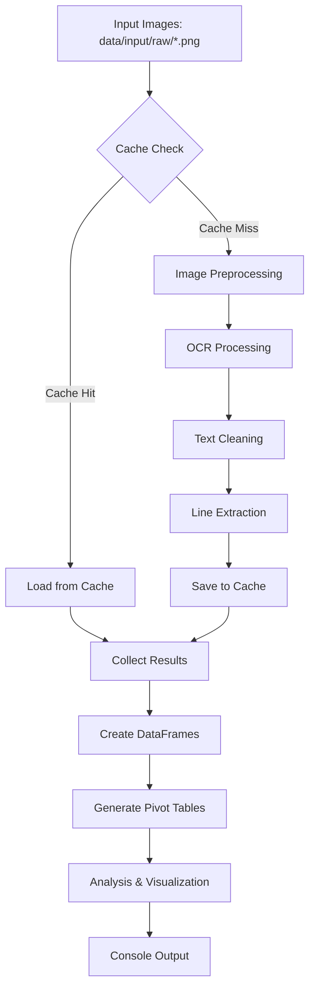

# Threshold Optimizer - Inputs and Outputs Specification

**Document Version**: 1.0  
**Date**: August 24, 2025  
**Module**: `flight_ocr.analysis.threshold_optimizer`

## Overview

The Threshold Optimizer is a sophisticated analysis tool that tests multiple OCR preprocessing thresholds to find optimal parameters for flight price extraction. It uses multiprocessing for efficient batch processing and provides detailed analysis reports.

---

## 🔍 **INPUTS**

### **1. Command Line Arguments**

| Parameter | Type | Default | Description |
|-----------|------|---------|-------------|
| `--no-refresh-cache` | flag | False | Use existing cache instead of recomputing |
| `--max-workers` | int | 4 | Maximum number of worker processes |

### **2. Configuration Constants**

Located in `batch_process()` function:

```python
images_dir = Path("data/input/raw")          # Input directory
threshold_from = 171                         # Starting threshold value  
threshold_to = 173                          # Ending threshold value
skip = 0                                    # Lines to skip from OCR output
take = 9                                    # Lines to take for processing
```

### **3. Input Files**

#### **Image Files**
- **Location**: `data/input/raw/`
- **Pattern**: `*.png` (excluding files starting with `_`)
- **Examples**: 
  ```
  flight-2025-08-23 10-24-12.png
  flight-2025-08-23 10-24-54.png
  flight-2025-08-23 11-27-32.png
  ```

#### **Cache Files (Input - Optional)**
- **Location**: `data/cache/ocr_text/`
- **Format**: `{image_name}_thr{threshold}.pkl`
- **Structure**: Pickle files containing tuples `(count, dataframe)`
- **Examples**:
  ```
  flight-2025-08-23 10-24-12.png_thr171.pkl
  flight-2025-08-23 10-24-54.png_thr172.pkl
  ```

#### **Raw Cache Files (Input - Optional)**
- **Location**: `images/.raw_cache/` 
- **Format**: `{image_stem}_{threshold}.pkl`
- **Structure**: Raw OCR text strings before processing
- **Purpose**: Intermediate caching of raw OCR results

### **4. System Dependencies**

#### **Required Dependencies**
```python
import argparse, concurrent.futures, os, pickle, sys
from datetime import datetime
from functools import partial  
from pathlib import Path
```

#### **Optional Dependencies (Enhanced Features)**
```python
import pandas as pd          # For data analysis and pivot tables
import matplotlib.pyplot as plt  # For chart generation  
from rich import print as rprint  # For colorful terminal output
from rich.console import Console  # For table display
from rich.table import Table     # For formatted tables
```

#### **Internal Dependencies**
```python
from flight_ocr.utils.cache import get_cache_file, load_from_cache, save_to_cache
from flight_ocr.utils.cleaning import clean_lines
from flight_ocr.core.image_processor import preprocess_image, run_ocr
```

---

## 📤 **OUTPUTS**

### **1. Console Output (Real-time)**

#### **Progress Reports**
```
🔍 Running threshold optimization analysis...
📁 Found 15 images to process with thresholds 171-173
[18:05:19][Worker 33848] recomputing and writing to cache: 
C:\...\data\cache\ocr_text\flight-2025-08-23 10-24-12.png_thr171.pkl
[18:05:19] Processed flight-2025-08-23 10-24-12.png (threshold=171) [1/45]: 77 lines found
```

#### **Analysis Results**
```
Total lines printed (threshold=171-173, skip=0, take=9): 3465

Results DataFrame:
   image                              threshold  line
0  flight-2025-08-23 10-24-12.png    171        Sun
1  flight-2025-08-23 10-24-12.png    171        Aug24
...

Pivot table (count of lines per threshold, with totals):
threshold    171    172    173    Total
line        1155   1155   1155    3465

Threshold(s) with the lowest count (1155): [171, 172, 173]
```

### **2. Cache Files (Generated)**

#### **OCR Text Cache**
- **Location**: `data/cache/ocr_text/`
- **Format**: `{image_name}_thr{threshold}.pkl`
- **Structure**: 
  ```python
  (count: int, dataframe: pandas.DataFrame)
  # Where dataframe contains columns: ['image', 'threshold', 'line']
  ```
- **Purpose**: Stores processed OCR results to avoid recomputation

#### **Raw Cache Files**
- **Location**: `images/.raw_cache/`
- **Format**: `{image_stem}_{threshold}.pkl`  
- **Structure**: Raw OCR text string
- **Purpose**: Caches unprocessed OCR output

### **3. Data Structures**

#### **Task Structure**
```python
tasks = [(image_path, threshold, skip, take), ...]
# Example: (Path('data/input/raw/flight-2025-08-23 10-24-12.png'), 171, 0, 9)
```

#### **Results DataFrame**
```python
columns = ['image', 'threshold', 'line']
# Example rows:
# flight-2025-08-23 10-24-12.png, 171, "Sun"
# flight-2025-08-23 10-24-12.png, 171, "Aug24"
# flight-2025-08-23 10-24-12.png, 171, "$299"
```

#### **Pivot Tables**
```python
# Pivot 1: Lines per image/threshold
pivot = results_df.pivot_table(
    index='image', columns='threshold', values='line', 
    aggfunc='count', fill_value=0, margins=True
)

# Pivot 2: Lines per threshold (summary)  
pivot2 = results_df.pivot_table(
    index='threshold', values='line',
    aggfunc='count', fill_value=0, margins=True
)
```

### **4. Visual Output**

#### **Rich Tables** (if available)
- Formatted pivot tables with color-coded columns
- Progress indicators with timestamps
- Error messages in color-coded format

#### **Charts** (if matplotlib available)
- Bar charts showing line counts per threshold
- Saved to display or file (depending on implementation)

### **5. Analysis Reports**

#### **Threshold Comparison**
- Total line counts per threshold value
- Identification of optimal thresholds (lowest noise)
- Sorted results for easy comparison

#### **Image-Level Analysis**
- Processing status for each image
- Individual line counts per image/threshold combination  
- Cache usage statistics

---

## 🔄 **DATA FLOW**

### **Processing Pipeline**



### **Multiprocessing Architecture**

```
Main Process
├── ProcessPoolExecutor (max_workers=N)
│   ├── Worker 1: process_wrapper(image1, threshold171, skip, take)
│   ├── Worker 2: process_wrapper(image2, threshold171, skip, take)  
│   └── Worker N: process_wrapper(imageX, thresholdY, skip, take)
└── Results Aggregation
    ├── DataFrame Creation
    ├── Pivot Table Generation
    └── Analysis Report
```

---

## 📊 **EXAMPLE EXECUTION**

### **Input Configuration**
```python
images_dir = "data/input/raw"
images = [flight-2025-08-23 10-24-12.png, ...]  # 15 images
threshold_range = 171-173  # 3 thresholds
total_tasks = 15 × 3 = 45 tasks
max_workers = 4
```

### **Output Summary**
```
📁 Found 15 images to process with thresholds 171-173
[Processing 45 tasks with 4 workers...]
Total lines printed (threshold=171-173, skip=0, take=9): 3465

Optimal thresholds: [171] (lowest line count: 1155)
Cache files created: 45 .pkl files
```

---

## 🛠 **CONFIGURATION OPTIONS**

### **Modifiable Parameters**

| Parameter | Location | Current Value | Purpose |
|-----------|----------|---------------|---------|
| `images_dir` | `batch_process()` | `"data/input/raw"` | Input image directory |
| `threshold_from` | `batch_process()` | `171` | Starting threshold |
| `threshold_to` | `batch_process()` | `173` | Ending threshold |
| `skip` | `batch_process()` | `0` | Lines to skip in OCR |
| `take` | `batch_process()` | `9` | Lines to process |
| `max_workers` | CLI argument | `4` | Parallel processes |

### **Cache Configuration**

| Setting | Value | Purpose |
|---------|-------|---------|
| OCR Cache Directory | `data/cache/ocr_text/` | Processed results |
| Raw Cache Directory | `images/.raw_cache/` | Raw OCR output |
| Cache Format | Pickle (.pkl) | Python object serialization |
| Cache Naming | `{image}_{threshold}.pkl` | Unique per image/threshold |

---

## 🔧 **TROUBLESHOOTING**

### **Common Input Issues**

| Issue | Cause | Solution |
|-------|-------|---------|
| "No PNG images found" | Empty input directory | Add .png files to `data/input/raw/` |
| "IndexError: list index out of range" | Empty task list | Ensure images exist and match pattern |
| Tesseract errors | Missing OCR engine | Install Tesseract or use mock mode |

### **Cache-Related Issues**

| Issue | Cause | Solution |
|-------|-------|---------|
| Permission errors | Write-protected cache dir | Check directory permissions |
| Stale cache data | Old cache files | Use `--no-refresh-cache` flag |
| Large cache size | Many images/thresholds | Clean cache directory periodically |

---

## 📝 **NOTES**

- **Thread Safety**: Uses ProcessPoolExecutor for true parallelism
- **Memory Management**: Results accumulated in main process memory
- **Error Handling**: Graceful degradation when optional dependencies missing
- **Extensibility**: Easy to modify threshold ranges and processing parameters
- **Performance**: Caching significantly reduces re-processing time

---

*This document provides a complete specification of all inputs and outputs for the Threshold Optimizer module. For implementation details, refer to the source code in `flight_ocr/analysis/threshold_optimizer.py`.*
